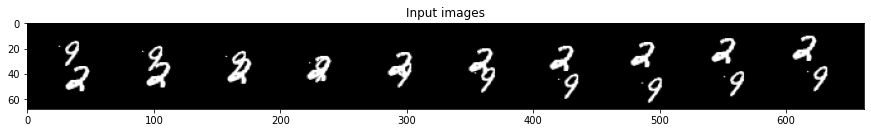
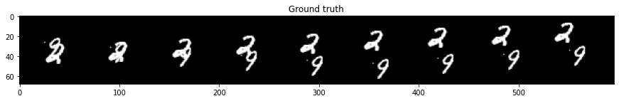

## Condtional DGAN

This is an implementation based on the paper <a href="https://dl.acm.org/doi/pdf/10.5555/3294771.3294855">PredRNN: recurrent neural networks for predictive learning using spatiotemporal LSTMs</a> 

A model for video prediction that takes an input sequence X to predict sequence Y.
The model make uses of ConvLSTM, but add one more memory cell M that is passed between timesteps. This memory cell M helps the model to keep track of what was remembered by the last layer of the previous timesteps (which cannot be done by memory cell C). The memory cell M is passed from the last layer of the previous timesteps to the first layer of the next time step. This new architecture of LSTM cell is called Spatiotemporal LSTM (shown in figure below)
 

 

### Result after training 5 epochs on MovingMnist

- Input sequence  

 

- Target sequence  

 

- Predicted sequence(second row)

